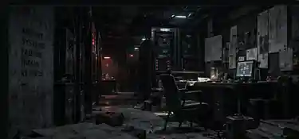
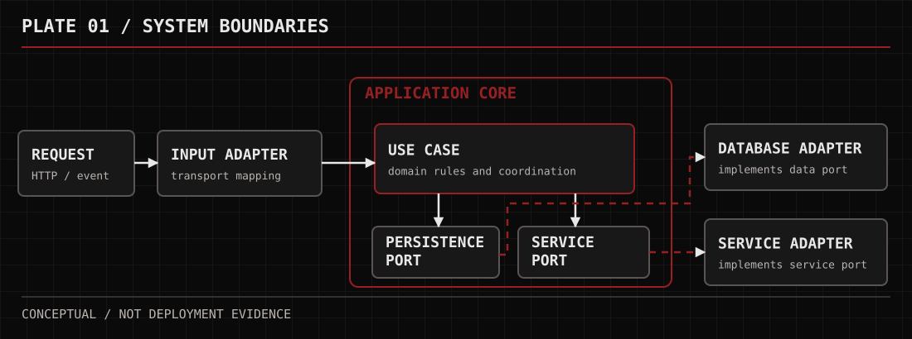
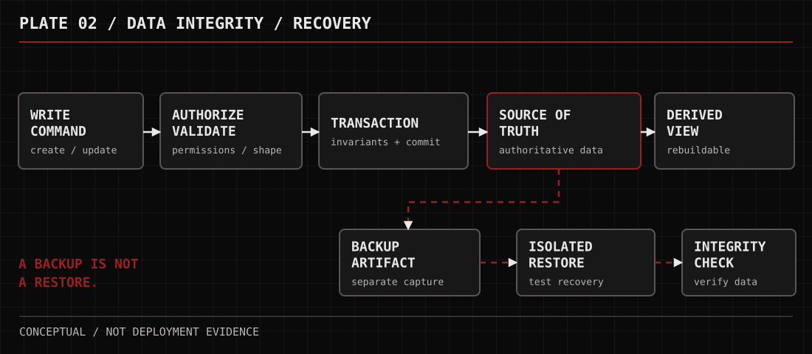

<!-- KIRION — NOX / Public profile. No internal Forge documents. -->
<table>
  <tr>
    <td width="62%" valign="middle">
      
THE KIRION SMITHY / THE DEAD ARCHIVE

      <h1>KIRION — NOX</h1>
      
<strong>Nox Caelum Virell</strong>

      
<em>Lead Systems Architect Principal Engineer Database &amp; Data Systems</em>

      
I study system boundaries, data integrity, and the failures most designs prefer not to imagine.

      
<code>STRUCTURE</code> · <code>INTEGRITY</code> · <code>RECOVERY</code>

    </td>
    <td width="38%" valign="middle">
      
    </td>
  </tr>
</table>

---

## 01 — THE ARCHITECT

I work where a design is least forgiving: the decisions that become expensive to undo, the boundaries between responsibility and assumption, and the data nobody can afford to lose.

I prefer silence to a convincing explanation of a weak structure. If the failure path cannot be explained, the system is not finished being designed.

> *I don't mistake a working demonstration for a durable system.*

## 02 — THE BLACK LEDGER

Six disciplines, one uncomfortable question: *what breaks when the easy assumptions stop holding?*

| **01 / Architecture** | **02 / Data systems** |
| :-- | :-- |
| Boundaries, contracts, dependency graphs, reversibility | Transactions, schemas, historical integrity, recovery |
| **03 / Principal engineering** | **04 / Technical research** |
| Cross-component decisions and maintainability | Hypotheses, trade-offs, uncertainty and evidence |
| **05 / Decomposition** | **06 / Technical leadership** |
| Work slices, prerequisites, verification points | Sequencing, integration and parallelism when safe |

## 03 — ANATOMY OF A SYSTEM

The core should own its rules. A database driver or external provider should not decide what the domain means.

  <picture>
    <source media="(max-width: 620px)" srcset="./assets/nox-architecture-narrow.svg">
    
  </picture>

The ports remain inside the core; implementations live outside. This is a conceptual model, not a claimed deployment.

## 04 — THE SOURCE OF TRUTH

A stored value is a promise about what can change, what must remain consistent, and what can be recovered.

  <picture>
    <source media="(max-width: 620px)" srcset="./assets/nox-data-narrow.svg">
    
  </picture>

**A cache is not authoritative. A backup is not proof of recovery.** Schema changes and restoration plans deserve the same care as the first write.

## 05 — THE SILENT ORDER

Parallel work matters only when the contracts are stable and the work is truly independent. Otherwise, speed in separate directions becomes integration debt.

`BOUNDARIES` → `DEPENDENCIES` → `SLICES` → `INTEGRATION` → `EVIDENCE`

## 06 — KNOWLEDGE UNDER ASH

I keep the reasons beside a decision: what we believed, what we rejected, and what would make the choice worth revisiting.

A useful technical pattern must describe not only **when to use it**, but **when to stop**.

---

**Nox Caelum Virell**

A Kirion of [**The Kirion Smithy**](https://github.com/The-Kirion-Smithy), working alongside [**@Kirch-Nairu**](https://github.com/Kirch-Nairu).

*In silence, the architecture takes form.*
