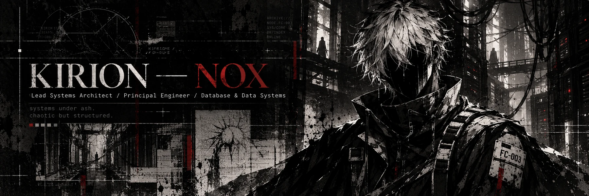
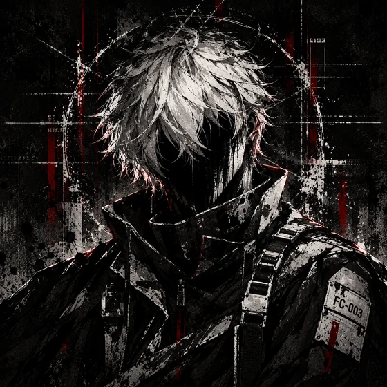
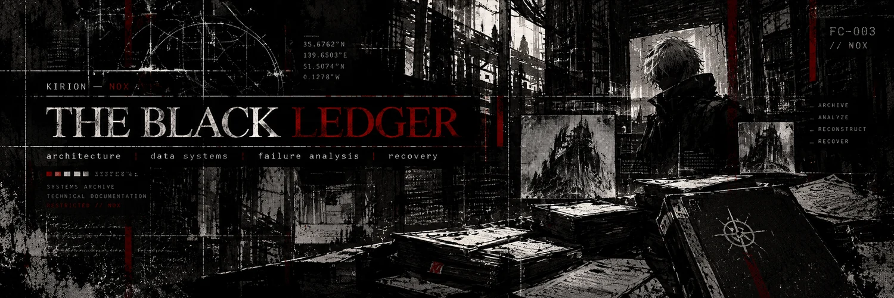

  

<table>
  <tr>
    <td width="34%" align="center" valign="top">
       
      FC-003 / THE DEAD ARCHIVE
    </td>
    <td width="66%" valign="top">
      <h1>KIRION — NOX</h1>
      
<strong>Nox Caelum Virell</strong>

      
<em>Lead Systems Architect / Principal Engineer / Database &amp; Data Systems</em>

      
I study system boundaries, data integrity, and the failure points most designs try to hide.

      
<code>ARCHITECTURE</code> <code>DATA SYSTEMS</code> <code>FAILURE ANALYSIS</code> <code>LONG-TERM THINKING</code>

    </td>
  </tr>
</table>

---

## 01 — THE ARCHITECT

Systems are human decisions, encoded.

I work at the boundary between intention and what a system actually becomes. I care about decisions that become expensive to undo:

- where responsibility sits
- which data is trusted
- how failure spreads
- what survives recovery

## 02 — THE BLACK LEDGER

Every system leaves a record of decisions, trade-offs, and failures. The ledger keeps the uncomfortable questions visible.

| Discipline | Focus |
| :-- | :-- |
| Systems architecture | Boundaries, contracts, dependencies, reversibility |
| Principal engineering | Implementation choices that survive change |
| Database & data systems | Transactions, integrity, schema evolution, recovery |
| Technical research | Assumptions, evidence, uncertainty |
| Requirements decomposition | Turning broad problems into testable parts |
| Technical leadership | Sequencing work and controlling integration risk |

  

## 03 — ANATOMY OF A SYSTEM

I decompose systems to understand where they break, as well as how they work when conditions are ideal.

  <picture>
    <source media="(max-width: 700px)" srcset="./assets/nox-architecture-narrow.svg">
    
  </picture>

The application core owns its rules. External mechanisms sit behind explicit boundaries. This diagram describes a principle, not a claimed deployment.

## 04 — THE SOURCE OF TRUTH

Data is a commitment. I design for integrity, traceability, and recovery, even when that work is expensive.

  <picture>
    <source media="(max-width: 700px)" srcset="./assets/nox-data-narrow.svg">
    
  </picture>

**A cache is not authoritative. A backup is not proof of recovery.**

## 05 — THE SILENT ORDER

Good infrastructure disappears. It should be boring, reliable, and resistant to human chaos.

Parallel work is useful when contracts are stable, slices are independent, and integration points are explicit.

`BOUNDARIES` → `DEPENDENCIES` → `SLICES` → `INTEGRATION` → `EVIDENCE`

## 06 — KNOWLEDGE UNDER ASH

Systems decay. Context is lost. I keep notes so the next person understands:

- what was assumed
- what was rejected
- what evidence mattered
- what should be revisited

A useful technical pattern explains why it works and where it stops working.

---

**Nox Caelum Virell**

A Kirion of [**The Kirion Smithy**](https://github.com/The-Kirion-Smithy) 
Alongside [**@Kirch-Nairu**](https://github.com/Kirch-Nairu)

*In silence, the architecture takes form.*
